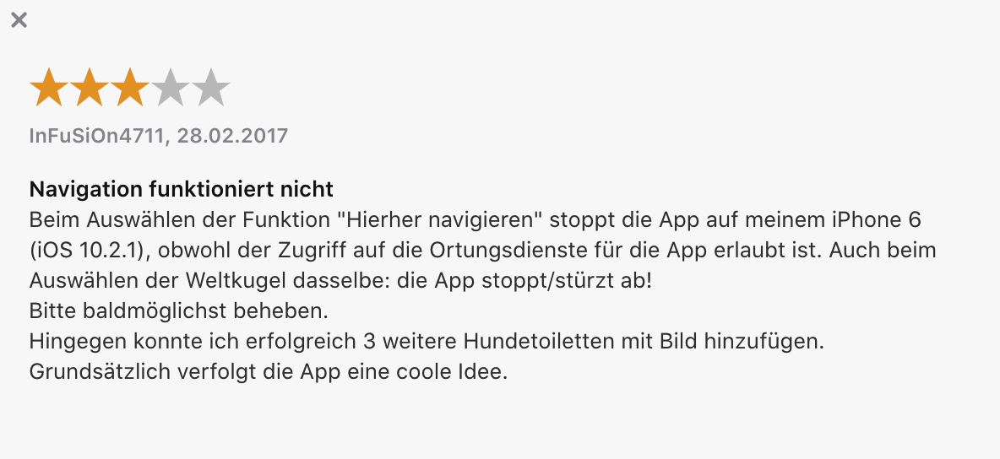

## What is this

This is intended as a friendly, analysis of a public digital product (The Robidog Dog Toilet Finder). The intention of such an analysis is to figure out what we can learn from the execution, what can be improved and what we would do differently?

## Background (What are dog bags?)

In Switzerland, in and around most urban areas the local municipality makes sure there is an adequate amount of waste bins equipped with plastic bag dispensers. These plastic dispensers are used by dog owners to make it easy for them to pick up their dog's poop. They can use the bag as a cover for their hand while they pick up the poop. After picking it up, while still holding the poop, they can turn the bag inside out, leaving the poop in the bag while keeping the hand clean. The poop-filled bag can then be deposited in the bin.

Initially I thought the bins equipped with these plastic bags were special bins for dog poop only. It turns out this is not the case. These bins can be used as regular bins as well.

## What is Robidog

While walking our dog around the block, I've come accustomed to seeing the orange plastic bags dispensed at the nearby doggy bin. I saw that they were being issued by a company called Robidog and they included some nice instructions on how to pick up and dispense with the dog poop without getting your hands dirty (in case that was you!). In addition to the intructions there was also a QR code on the bag, which seemed to be indicating there was an accompanying app. So I decided to check it out.

## What is the Robidog app?

Sure enough, the QR code, when read, provides the user with a URL they can choose to follow. This brings them to a landing page for the Robidog Finder app. There are links and QR codes for iOS, Android and Windows Phone versions.

The iOS link points to the App Store where a native version of the app can be downloaded. The Android and Windows versions link to a responsive web app, which is only accessible from mobile devices.

I've turned the web app into a clickable prototype so you can easily click through it yourself to get a feeling for the app's functionality. You can find it [here](https://www.figma.com/proto/UuZmpLY4jXSooDpYGtBqd0/Robidog?node-id=2%3A9&scaling=min-zoom).

I always think there's value in coming up with a Product Definition Statement to help create clarity around what a product is (and what it's not).

### The Robidog Finder product definition statement

Robidog finder is a native iOS app & web-app (only accessible on mobile devices) which allows dog owners to find the nearest doggy bin based on their GPS coordinates. The app contains a database of dog toilets which are crowdsourced from the app users themselves. This is made possible by the app's second feature which allows dog owners to submit a new doggy bin location by submitting the user's GPS coordinates as well as a picture of the doggy bin.

## How to think about digital products (User goals & Business goals)

When it comes to digital products we here at Pocket Revolutions encourage people to think of successful products as products that are (1) helping the user accomplish a goal and (2) helping the business reach a goal. If you think in those terms, you can understand a product quite quickly.

## What are the user goals here?

Disclaimer: We can only make educated guesses about the user's true goals here as we have not spoken to the end-users themselves. What follows is an educated guess.

There might be different scenarios in which a dog owner is interested in locating the nearest doggy bin. The doggy bin's plastic bags tend to get restocked every week. Certain doggy bins are used more often and as such they tend to run out of plastic bags quicker. Sometimes there will be no bags left for multiple days before they get restocked. Dog owners usually carry some spare bags, but sometimes they may catch themselves in a situation where their dog has just relieved themselves, they are out of spare bags, and the doggy bin is also out of plastic bags. In these cases a dog owner may ask themselves, what's the nearest doggy bin besides this one? But with one additional criterion: What is the nearest doggy bin besides this one, which still has a stock of plastic bags?

It's also worth considering the competing solutions in this case. One option for the dog owner is to do nothing. Leaving the dog poop is considered very bad manners in Switzerland.

Another option could be notifying Robidog, or the gemeinde, which specific doggy bin has run out of plastic bags. Robidog can collect this data and make more sense of it before presenting it back to the gemeinde.

### A personal anecdote

I live in Muttenz and we have a dog. But after a week or two of living here, I know pretty much where the dog toilets are. There have been moments that I've wondered where is the nearest dog toilet. But these moments have been few and far between.

- Although Robidog Finder is an English name, the app landing page defaults to German with no option to switch to English.

## What are the business goals for Robidog AG?

Without speaking with Robidog themselves (if you're reading this, Robidog, feel free to get in touch at jesse@pocketrevolutions.com), we can only make informed guesses as to what the business goals are with the Robidog Finder app and whether they're being met. Here's what I've come up with:

- It helps create a positive brand image of Robidog AG with the users that use it. With an app Robidog comes across as being innovative and appearing to know what they're doing.
- It helps create a positive brand image for the municipalities that purchase such a solution. E.g. it seems that Robidog is the go-to place for dog bins

## Some observations

They made several design choices that are worth noting.

- They decided to allow people to add or spot dog toilets in the wild
- The decided to make the app a web app
- The way people discover the app is the QR code on the bag
  - There are some problems with this however. You need to be a relatively tech savvy user to understand that the QR code can and needs to be scanned.
- Also who exactly is in need of this solution?
- What is the incentive for people to contribute the dog toilets to the app?

## What are they doing well?

### The app is getting used

It's apparent from the user-submitted dog toilets that the app is indeed getting used. There also seems to be a regular influx of review on the App Store which would also indicate usage.

## What can they improve?

### If you allow for users to add something you need to allow for them to delete it as well.

### All apps will require maintenance

### No app might be better than an app with bad reviews

### What could they do differently?

Here are some related problems that I know I have.

I don't know where the nearest place is to walk the dog.

Sometimes there are no bags left at one station. At certain stations on a Sunday there are almost always no bags left. This information could be relayed to the local Gemeinde.

### Vandalisation, a real problem?

It was reported in Blick that the Robidog bins were replaced in Bern and Zurich. The main reason being that they were being repeatedly vandalized and the replacements were costly. Not only that but the dog feces were not being disposed of separate to the normal trash. The solutions Zurich and Bern opted for was outfitting the normal bins with doggy bags.

Here we do see something that appears to be a more serious problem. The bins are being repeatedly vandalized. How can this be handled? I can imagine this being somewhat ameliorated by the material choice of the bin.

### **Conclusion & Advice**

I do think you can identify problems that can be solved for the company, Robi AG, as well as for the user. But based on the information at my disposal, these seem like low intensity problems. Low intensity problems, when solved, lead to solutions which only provide marginal value. And because only marginal value is provided, only marginal value can be captured by the company. And because only marginal value can be captured by the company, this doesn't justify spending money on the development of, say, a native app.

As such it looks to me like Robi AG have done a sensible thing. They've created an app with an affordable tech stack. They cover the main mobile platforms. They don't cover desktop, but this also doesn't seem like a huge issue but the use case for using desktop seems even more unlikely.

- Remove the app from the iPhone app store. The alternative is to commit to ongoing maintenance, but as there doesn't seem to be a strong business case for it, it's better to remove the bad press.
- If their app is simply a web app then it would make sense to make it a progressive web app which can also be downloaded and displayed on the home screen like a normal app.
- Implement the improvements on the web version.

  - With an ability to add dog bins there should be the ability to remove them, edit them and also to flag bins for correction. In others words if you allow users to Create, you need to allow them to Read, Update and Delete as well.
  - Fix the issues with the navigation not working.

    - Affordable solution: Allow the users to open the location in their native mapping app of choice e.g. Google Maps or Apple Maps.

    
